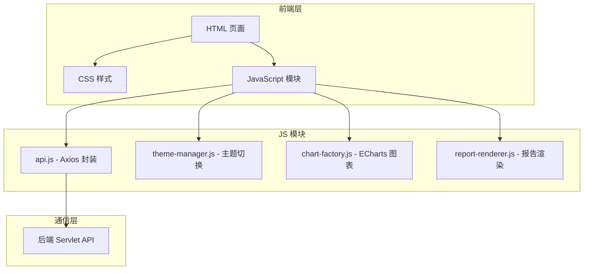

# 架构文档

## 1. 整体架构



## 2. 核心模块

### 2.1 api.js - 网络请求模块
- 统一的 Axios 封装
- 请求拦截和响应拦截
- 请求胶囊 UI 反馈

### 2.2 theme-manager.js - 主题模块
- 日间/夜间自动切换
- 手动切换支持
- localStorage 持久化

### 2.3 chart-factory.js - 图表模块
- ECharts 配置生成
- 支持 bar/line/pie/scatter/mix 类型
- 智能双 Y 轴检测

### 2.4 report-renderer.js - 报告渲染
- sections 驱动的报告渲染
- 文本和图表混合展示

## 3. 数据流向

```
用户操作 → JavaScript 事件 → api.js → 后端 API → JSON 响应 → 渲染更新
```

## 4. 技术选型

| 技术 | 用途 |
|------|------|
| HTML5 | 页面结构 |
| CSS3 | 样式和主题 |
| JavaScript ES6+ | 交互逻辑 |
| Axios | HTTP 请求 |
| ECharts | 数据可视化 |
| GSAP | 动画效果 |
