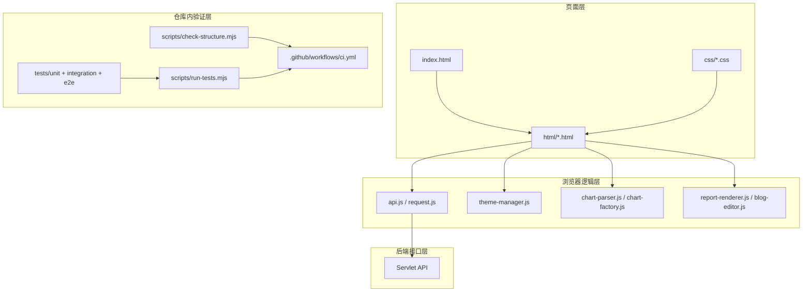

# 架构文档

## 1. 整体结构



## 2. 核心模块

### 2.1 `index.html`

- 作为 Web 容器欢迎页
- 将应用根路径跳转到 `html/login.html`
- 避免直接从 `/hivehbase/` 加载页面时 `../css`、`../js` 等相对路径解析到应用外层

### 2.2 `api.js`

- 统一创建 Axios 实例
- 自动推导部署根路径
- 管理请求胶囊 UI
- 暴露 `window.resolveAppUrl()` 供页面拼接应用内地址

### 2.3 `request.js`

- 对 `GET / POST / PUT / DELETE` 做轻量封装
- 统一为请求注入 `requestName`

### 2.4 `theme-manager.js`

- 初次加载时跟随系统主题
- 用户手动切换后持久化到 `localStorage`
- 系统主题变化时，仅在没有手动偏好时自动跟随

### 2.5 图表与报告模块

- `chart-parser.js`：把表格型数据转换成图表维度 / 系列
- `chart-factory.js`：按图表类型生成 ECharts 配置
- `report-renderer.js`：将分段报告渲染到页面
- `blog-editor.js`：报告编辑交互逻辑

## 3. 数据流

```text
用户操作
  -> HTML 事件
  -> 浏览器脚本
  -> api.js / request.js
  -> Servlet API
  -> JSON 响应
  -> 页面渲染 / 主题更新 / 图表刷新
```

## 4. 测试与校验设计

### 4.1 结构检查

`scripts/check-structure.mjs` 负责检查：

- 核心目录和文档是否存在
- `package.json` 脚本是否指向真实入口
- HTML 中的本地资源引用是否存在
- 仓库内是否重新引入已删除的前端测试骨架或无关模块

### 4.2 Node 内建测试

- `tests/unit/`：纯逻辑测试，覆盖 `ChartParser` 和 `ThemeManager`
- `tests/integration/`：构造轻量浏览器桩环境，验证 `api.js`
- `tests/e2e/`：对 HTML 页面做资源与基本文档结构冒烟检查

### 4.3 CI 责任边界

当前前端仓库 CI 只验证当前仓库内容本身，不依赖外部前端测试骨架，也不负责后端发布。
